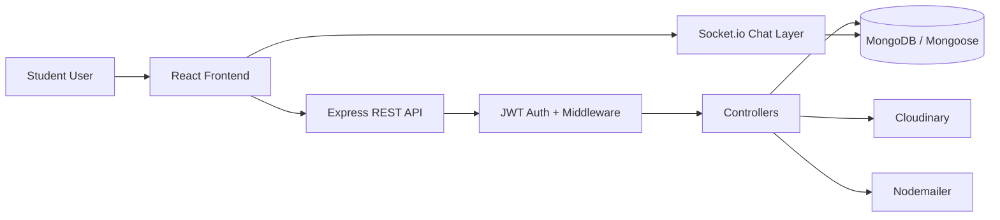

# CAMPUSTRADE — Technical Discussion Notes

## 1. Project overview
CampusTrade is a campus-focused peer-to-peer marketplace for students to buy, sell, and exchange items such as books, notes, electronics, and lab equipment. It is built as a full-stack MERN application with REST APIs for marketplace operations and Socket.io for real-time chat.

## 2. Tech stack
- Frontend: React, React Router, Axios, Socket.io client
- Backend: Node.js, Express.js, Socket.io
- Database: MongoDB with Mongoose
- Auth/security: JWT, bcrypt, Helmet, CORS, rate limiting, input validation
- Media: Cloudinary for image uploads
- Email: Nodemailer for verification and password reset
- Testing: Playwright end-to-end tests

## 3. High-level architecture

## 4. Frontend architecture
The frontend is organized under the React app structure in the client folder:
- Pages: login, register, marketplace, product details, cart, orders, chat, notifications, profile
- API client: Axios instance in client/src/app/axiosConfig.js attaches the JWT token to requests
- Socket client: client/src/features/chat/socket.js initializes the Socket.io connection
- Runtime config: client/src/utils/runtimeConfig.js provides base URLs for API and Socket endpoints

### Frontend request flow
1. The UI calls the REST API through the Axios wrapper.
2. Protected routes send the Bearer token from local storage.
3. Chat uses Socket.io for real-time send/read/delivery events.
4. The app stores auth state in local storage and uses route guards for private pages.

## 5. Backend architecture
The backend is split into route, controller, middleware, model, socket, and config layers:
- app entry: server/src/app.js
- routes: auth, products, cart, chat, payment, users
- controllers: auth.controller, product.controller, cart.controller, chat.controller, payment.controller
- middleware: auth.middleware, rateLimit.middleware, validate.js, upload.middleware
- models: User, Product, Cart, Order, Message
- DB config: server/src/config/db.js
- env config: server/src/config/env.js

### Request lifecycle
1. Express app receives HTTP request.
2. CORS, Helmet, body parsing, cookie parsing, and validation middleware run.
3. Auth middleware protects private endpoints.
4. Rate limiter may block excessive requests.
5. Controller executes business logic.
6. Data is persisted to MongoDB or external services like Cloudinary/email.

## 6. API inventory

### Authentication APIs
| Method | Endpoint | Purpose | Protection |
|---|---|---|---|
| POST | /api/auth/register | Register new user and send verification email | Public |
| POST | /api/auth/login | Sign in and return JWT | Public |
| POST | /api/auth/forgot-password | Send password reset link | Public |
| POST | /api/auth/reset-password/:token | Reset password | Public |
| GET | /api/auth/verify/:token | Verify email token | Public |
| POST | /api/auth/logout | Logout user | Public/optional auth |
| POST | /api/auth/refresh | Refresh token | Public/optional auth |

### User APIs
| Method | Endpoint | Purpose | Protection |
|---|---|---|---|
| GET | /api/users/me | Get current user profile | Protected |
| PUT | /api/users/profile | Update profile | Protected |

### Product APIs
| Method | Endpoint | Purpose | Protection |
|---|---|---|---|
| GET | /api/products | Browse all products | Public |
| POST | /api/products | Create product listing | Protected |
| GET | /api/products/mine | Get current seller’s listings | Protected |
| GET | /api/products/:id | Get product details | Public |
| PUT | /api/products/:id | Update a product | Protected |
| PUT | /api/products/:id/sold | Mark product as sold | Protected |
| DELETE | /api/products/:id | Delete a product | Protected |

### Cart APIs
| Method | Endpoint | Purpose | Protection |
|---|---|---|---|
| GET | /api/cart | Get cart contents | Protected |
| POST | /api/cart/items | Add product to cart | Protected |
| DELETE | /api/cart/items/:productId | Remove item from cart | Protected |
| DELETE | /api/cart | Clear cart | Protected |

### Chat APIs
| Method | Endpoint | Purpose | Protection |
|---|---|---|---|
| GET | /api/chat/conversations | Get conversation list | Public-ish / validated |
| GET | /api/chat/messages | Fetch messages between users | Public-ish / validated |
| GET | /api/chat/room | Get chat room id | Public-ish / validated |
| GET | /api/chat/unread-count | Get unread count | Public-ish / validated |
| POST | /api/chat/messages | Send a chat message | Public-ish / validated |
| POST | /api/chat/mark-delivered | Mark messages as delivered | Public-ish / validated |
| POST | /api/chat/mark-read | Mark messages as read | Public-ish / validated |
| DELETE | /api/chat/conversation | Hide conversation for user | Public-ish / validated |

### Payment/Order APIs
| Method | Endpoint | Purpose | Protection |
|---|---|---|---|
| POST | /api/payment/setup-razorpay | Link Razorpay account for seller | Protected |
| GET | /api/payment/config-status | Check whether payment gateway config exists | Protected |
| POST | /api/payment/create-order | Create online order | Protected |
| POST | /api/payment/create-offline-orders | Create COD/offline order | Protected |
| POST | /api/payment/verify-payment | Verify payment and transfer funds | Protected |
| GET | /api/payment/orders | Get buyer orders | Protected |
| GET | /api/payment/seller-orders | Get seller orders | Protected |
| PATCH | /api/payment/orders/:orderId/offline-status | Update offline order lifecycle | Protected |

### Health/API utility
| Method | Endpoint | Purpose | Protection |
|---|---|---|---|
| GET | /api/health | Basic health check | Public |

## 7. Authentication flow
Authentication is implemented with JWT bearer tokens.

Flow:
1. User registers with college email.
2. Server validates the input and hashes the password with bcrypt.
3. A verification token is generated and sent by email using Nodemailer.
4. The user verifies the email.
5. On login, the server issues a JWT token.
6. The protect middleware validates the token for every protected route.

### Auth behavior
- Missing/invalid/expired token returns 401.
- Wrong credentials return 401.
- Unverified account returns 403.
- Password reset uses a hashed one-time token.

## 8. MongoDB connection and schema design
MongoDB connection is created through Mongoose in server/src/config/db.js using the MONGO_URI value from environment variables.

Main collections/schemas:
- User: authentication and profile info
- Product: listings, price, category, stock fields, seller reference
- Cart: buyer cart items
- Order: purchase state, payment mode, offline status, seller breakdown
- Message: chat content, delivery/read timestamps, deletion flags

### Key stock fields on Product
- availableCopies
- reservedCopies (derived from pending/active orders)
- purchasableCopies (computed from stock and reservations)
- stockStatus
- isSold

## 9. Real-time chat via Socket.io
Chat is handled with Socket.io.

### Client side
- The client connects to the Socket server using the socket client wrapper.
- The UI joins a room based on the sorted pair of user IDs.

### Server side
- Events handled in server/src/sockets/chat.socket.js:
  - join: join a private room
  - sendMessage: save message to MongoDB and broadcast to room
  - messageDelivered: update delivery timestamp and notify peers
  - messagesRead: update read timestamps and notify peers

### Data flow
- REST endpoints provide conversation history and unread counts.
- Socket events provide real-time send/read/delivery updates.

## 10. Inventory handling and overselling protection
Inventory logic is designed to prevent overselling.

### Current approach
- Each product keeps track of available copies.
- Before adding items to cart, the server checks how many copies are still purchasable.
- Before creating an order, the server checks active reservations for that product.
- When an offline order is completed or a payment is verified, stock is decremented.
- If stock reaches zero, the product is marked as sold.

### Reservation logic
Orders in pending state with online payment or offline payment in statuses such as placed/accepted/scheduled are treated as reserving copies. That means the same stock cannot be purchased repeatedly by different buyers.

### Important limitation
The current implementation uses pre-checks and sequential updates. That is good for a mini project, but for true production-grade safety it should be upgraded to atomic database updates or transactions to eliminate race conditions completely.

## 11. Rate limiting and security hardening
The backend applies multiple limiter layers:
- generalLimiter: broad traffic control
- authLimiter: strict cap on auth requests
- chatLimiter: message send throttling
- chatReadLimiter: read/conversation request throttling
- productLimiter: listing creation throttling
- paymentLimiter: payment/action throttling

Security measures include:
- Helmet for HTTP headers
- CORS restriction to allowed origins
- JSON payload size limits
- input validation and sanitization
- JWT verification for protected routes
- password hashing with bcrypt
- environment-based secrets handling

## 12. Edge cases handled or explicitly considered
The app includes handling for several important edge cases:
- Invalid or expired JWT
- Wrong credentials and locked-out behavior via rate limiting
- Unverified emails
- Duplicate email registration
- Missing required fields
- Invalid product quantity
- Buying more copies than currently purchasable
- Seller trying to add their own product to the cart
- Lend-only items being blocked from cart checkout
- Product already sold out
- Invalid ObjectId in chat or product requests
- Finalized orders cannot be changed again
- Invalid offline status transitions
- Payment gateway not configured
- Payment details missing for verification
- Invalid chat payloads
- Conversation delete/hide for one user only

## 13. Scaling considerations
The current implementation is suitable for a campus-level demo, but for larger scale the following changes would help:
- Run multiple Node instances behind a load balancer
- Keep the API stateless and rely on shared MongoDB
- Use a Redis adapter for Socket.io when many chat connections exist
- Add sticky sessions or a WebSocket gateway for real-time traffic stability
- Use CDN and image optimization for product media
- Add caching for marketplace reads and conversation lists
- Use background queues for email and notification jobs

## 14. Key takeaway
CampusTrade is not just a basic CRUD app. It combines authentication, protected APIs, real-time messaging, inventory-safe checkout logic, and production-style security layers in a single end-to-end system.
